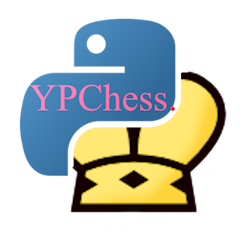

# YPChess 

Minimal and mostly efficient chess engine made in Python.

## Usage

1. Download the source code
2. Run main.py to play a game with the engine in the terminal. (3 or 4 depth is recommended)

No UCI support as of now, but planned for the future.

## Credits

This engine is based off this tutorial:
<https://www.youtube.com/watch?v=4qwFwdCcgac>

<https://github.com/dereckpiche/chess_bot>
